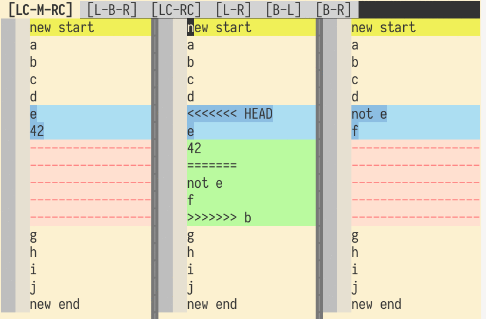

# Git conflicts resolution like a boss

Made for vim but views can be easily adapted to other tools like meld.
Just not with the same bells'n'whistles. You know... Vim is the best, right?



## Theory

The main problem of merge conflicts is they can be often mangled beyond
recognition and it's not obvious what has been changed and how.

**The solution: see them from different angles!** I mean different diffs... And
don't expect miracles!

Git provides 4 versions of the file to begin with:
* _local_
* _remote_
* _base_ - a common "ancestor" for _local_ and _remote_ version
* _merged_ - git's attempt to merge _local_ and _remote_ with conflict leftovers,
  also your work file which you are supposed to polish

To add more to the mix the script generates 2 extra files:
* _local_ with its part of the conflict (LC) - take the _merged_ version and
  remove the _remote_ part of the conflict
* _remote_ with its part of the conflict (RC) - like the _local_ but _remote_
  (who would have thought)

These should be enough. In theory. Now diff them in miscellaneous combinations and profit! ... Well, you don't have to diff them by yourself. A chosen set of diffs will be given to you.

## Prerequisites

* vim (any flavor should do)
* https://github.com/gcmt/taboo.vim (for better tab names)

## Setup

1. Copy `diffconflicts` to e.g. `/usr/local/bin`.
1. Add to `~/.gitconfig`:
    ```
    [mergetool "diffconflicts"]
        cmd=/usr/local/bin/diffconflicts gvim "$BASE" "$LOCAL" "$REMOTE" "$MERGED"
        keepBackup=false
        trustExitCode=true
    ```
    and execute:
    ```
    git config --global merge.tool diffconflicts
    ```

## Execution

When you hit a conflict then run `git mergetool` and fix dem filez!

If you want to quit vim without resolving the issue (because you're lazy or
something) then simply closing the session will make git still think you
resolved it. Vim does not know you gave up. You must quit with `:cq`.

## Other tips, bells and whistles

* Understand *local* and *remote*: First, don't call them _left_ and _right_.
  It'll just improve the confusion. Then google what _local_ and _remote_ mean.

* Colors: default vim colorscheme for diffs is quite harsh and distracting.
  Tone it down to some [pastel tones](https://www.dummies.com/art-center/performing-arts/drawing/pastels-for-dummies-cheat-sheet/).

* The diff view is too much mess and you'd like to see the file undistorted?
  Toggle the diff mode with `\td`:

    ```
    function! ToggleDiff()
        if &diff
            diffoff!
        else
            windo diffthis
        endif
    endfunction

    if &diff
        nmap <silent> <leader>td :call ToggleDiff()<cr>
    endif
    ```

* Lines are ugly long and line wrapping is flipping your mind? Flip your split
  with `:windo wincmd J` or `:windo wincmd L`.

* Show remote commit causing the conflict: `git show REBASE_HEAD`

* Show local commit: git blame on lines in the conflict.

## Source of inspiration
* https://github.com/whiteinge/dotfiles/blob/master/bin/diffconflicts
* https://stackoverflow.com/questions/161813/how-to-resolve-merge-conflicts-in-git-repository
* https://gist.github.com/karenyyng/f19ff75c60f18b4b8149
* https://vim.fandom.com/wiki/A_better_Vimdiff_Git_mergetool
